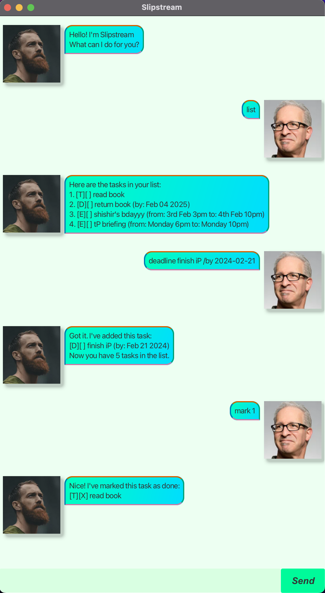

# Slipstream User Guide

Slipstream is a simple yet powerful task management chatbot designed to help users keep track of their to-dos, deadlines, and events. With a user-friendly interface and automatic data saving, Slipstream makes task management effortless!

## Quick Start

1. Ensure you have Java 17 installed (for MacOS users, you need Azul JDK 17).
2. Download the latest `slipstream.jar` from the repository's releases [here](https://github.com/senshir/ip)
3. Copy the file to the folder you want to use as the home folder for Slipstream.
4. Open a command terminal, cd into the folder you put the jar file in, and use the java -jar slipstream.jar command to run the application.
   A GUI similar to the below should appear in a few seconds. Note that the app may not have any tasks stored.

## Feature List

#### Note: Words in `UPPER_CASE` or `YYYY-MM-DD` are parameters to be supplied by the user, and /words are necessary to be written.
### Adding ToDo Tasks

To add a ToDo task, use the `todo` command followed by the task description.

Format: `todo DESCRIPTION`

Example: `todo Read book`

Expected outcome: The task "Read book" will be added to your task list.

### Adding Deadlines

To add a deadline task, use the `deadline` command followed by the task description and the deadline using `/by`.

Format: `deadline DESCRIPTION /by YYYY-MM-DD`

Example: `deadline Submit assignment /by 2023-12-01`

Expected outcome: The task "Submit assignment" with the deadline "Jan 01 2023" will be added to your task list.

### Adding Events

To add an event task, use the `event` command followed by the task description and the time frame using `/from` and `/to`.

Format: `event DESCRIPTION /from FROM /to TO`

Example: `event Project meeting /from 2023-12-01 10:00 /to 2023-12-01 12:00`
Expected outcome: The event "Project meeting" from "2023-12-01 10:00" to "2023-12-01 12:00" will be added to your task list.

Example: `event Meet friend /from 6pm later /to 8pm later`
Expected outcome: The event "Meet friend" from "6pm later" to "8pm later" will be added to your task list.

### Listing Tasks

To list all tasks, use the `list` command.

Example: `list`

Expected outcome: All tasks in your task list will be displayed.

### Marking Tasks as Done

To mark a task as done, use the `mark` command followed by the task number (as indicated by the list command).

Example: `mark 1`

Expected outcome: The task with the number 1 will be marked as done.

### Unmarking Tasks

To unmark a task, use the `unmark` command followed by the task number (as indicated by the list command).

Example: `unmark 1`

Expected outcome: The task with the number 1 will be unmarked.

### Deleting Tasks

To delete a task, use the `delete` command followed by the task number.

Example: `delete 1`

Expected outcome: The task with the number 1 will be deleted from your task list.

### Finding Tasks

To find tasks containing a specific keyword, use the `find` command followed by the keyword.

Example: `find book`

Expected outcome: All tasks containing the keyword "book" will be displayed.

### Rescheduling Tasks

To reschedule a *Deadline* task, use the `reschedule` command followed by the task number and the new date.

Example: `reschedule 1 2023-12-01`

Expected outcome: The deadline task with the number 1 will be rescheduled to the new date.

### Clearing All Tasks

To clear all tasks, use the `clear` command.

Example: `clear`

Expected outcome: All tasks will be cleared from your task list.

### Exiting the Chatbot

To exit the chatbot, use the `bye` command.

Example: `bye`

Expected outcome: The chatbot will display an exit message and terminate.

## Saving and Loading Data

By default, Slipstream will save your tasks to a file named `slipstream.txt` in ./data/slipstream.txt. 
When you run Slipstream again, it will automatically load the tasks from this file.

If you want to save your tasks to a different file,
you can specify the file path in the Storage.java file by modifying it.

## FAQ

#### Q: What if I accidentally close the chatbot without typing `bye`?
#### A: Don't worry! Slipstream automatically saves your tasks to a file, so you won't lose any data.

#### Q: How do I report a bug or provide feedback?
#### A: You may open an issue on our GitHub repository [here](https://github.com/senshir/ip)

## Conclusion

Slipstream is designed to make task management simple and efficient. Use the commands above to manage your tasks effectively. If you encounter any issues, please refer to the error messages for guidance.

Thank you for using Slipstream! 🚀